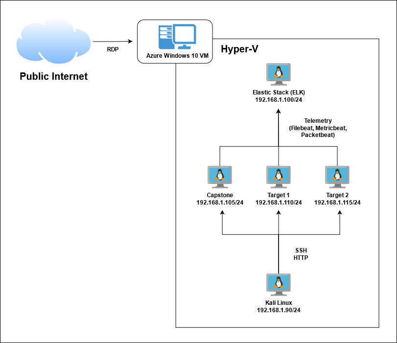

# Blue Team: Summary of Operations

## Table of Contents
- Network Topology
- Description of Targets
- Monitoring the Targets
- Patterns of Traffic & Behavior
- Suggestions for Going Further

## Network Topology

The following machines were identified on the network:
- Kali
  - **Operating System**: Kali Linux 2020.1
  - **Purpose**: Attacker Machine
  - **IP Address**: 192.168.1.90
- ELK
  - **Operating System**: Ubuntu 18.04 LTS
  - **Purpose**: Monitoring System
  - **IP Address**: 192.168.1.100
- Capstone
  - **Operating System**: Ubuntu 18.04 LTS
  - **Purpose**: Apache Web Server (Victim)
  - **IP Address**: 192.168.1.105
- Target 1
  - **Operating System**: Debian GNU/Linux 8
  - **Purpose**: Apache Web Server (Victim)
  - **IP Address**: 192.168.1.110
- Target 2
  - **Operating System**: Debian GNU/Linux 8
  - **Purpose**: Apache web Server (Victim)
  - **IP Address**: 192.168.1.115

## Description of Targets

The target of this attack was: `Target 1` (192.168.1.110).

Target 1 is an Apache web server and has SSH enabled, so ports 80 and 22 are possible ports of entry for attackers. As such, the following alerts have been implemented:

## Monitoring the Targets

Traffic to these services should be carefully monitored. To this end, we have implemented the alerts below:

### Excessive HTTP Errors
Excessive HTTP Errors is implemented as follows:
  - **Metric**: `WHEN count() GROUPED OVER top 5 'http.response.status_code' IS ABOVE 400 FOR THE LAST 5 minutes`
  - **Threshold**: Above 400
  - **Vulnerability Mitigated**: Enumeration / Brute Force Attack / DDoS
  - **Reliability**: High Reliability - normal traffic should not exceed this amount on a regular basis

### HTTP Request Size Monitor
HTTP Request Size Monitor is implemented as follows:
  - **Metric**: `WHEN sum() of http.request.bytes OVER all documents IS ABOVE 3500 FOR THE LAST 1 minute`
  - **Threshold**: Above 3500
  - **Vulnerability Mitigated**: Enumeration / Brute Force Attack / DDoS 
  - **Reliability**: Low Reliability - false positives are possible since there can be legitimate larger requests

### CPU Usage Monitor
CPU Usage Monitor is implemented as follows:
  - **Metric**: `WHEN max() OF system.process.cpu.total.pct OVER all documents IS ABOVE 0.5 FOR THE LAST 5 minutes`
  - **Threshold**: Above 0.5
  - **Vulnerability Mitigated**: Malicious processes running on the machine (malware, spyware, viruses)
  - **Reliability**: High Reliability - the increased CPU activity over baseline should alert to potential problems

## Suggestions for Going Further
The logs and alerts generated during the assessment suggest that this network is susceptible to several active threats, identified by the alerts above. In addition to watching for occurrences of such threats, the network should be hardened against them. The Blue Team suggests that IT implement the fixes below to protect the network:
- Brute Force Attack
  - **Patch**:
    1. Set stronger password requirements
    2. Hide WordPress login page via security plugin
    3. Two-factor Authentication
    4. Limit login attempts via security plugin
    5. Disable WordPress XML-RPC (if not in use)
  - **Why It Works**:
    1. Stronger password requirements make guessing the correct password much harder/longer. In addition not being listed in a readily available wordlist would increase security
    2. A brute force attack requires a target. If the attacker cannot find the login page then the attack cannot begin
    3. Added Two-factor Authentication would add an additional layer of security that an attacker would have low chance of bypassing
    4. Limiting the login attempts by IP would prevent any tools from attempting a brute force attack because the IP would not be allowed to submit more than the set number of attempts
    5. XML-RPC allows for users to remotely post, edit or delete content from the site which can be used to brute force login credentials. 
- Enumeration
  - **Patch**: WordPress Hardening
    1. Disable WordPress REST API (if not in use)
    3. Configure web server to block requests to /?author=\<number\>
  - **Why It Works**:
    1. The REST API included with WordPress allows information to be gathered on all users who have authored a public post 
    3. WordPress's permalink feature allows attackers to enumerate users by issuing requests with /?author=\<number\>
- DDoS
  - **Patch**: Disable WordPress XML-RPC (if not in use)
  - **Why It Works**: XML-RPC is responsible for enabling pingbacks and trackbacks, using this feature an attacker could DDoS the website by flooding the site with pingbacks/trackbacks
- Malicious Process
  - **Patch**: Add security and monitoring software to system, such as: Anti-Virus, Host Based Intrusion Detection System or Endpoint Detection and Reponse software 
  - **Why It Works**: These softwares can detect, notify and prevent malicious processes running on a system
