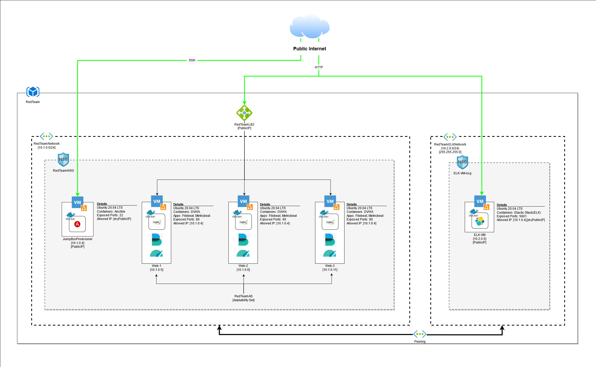

## Automated ELK Stack Deployment

The files in this repository were used to configure the network depicted below.



These files have been tested and used to generate a live ELK deployment on Azure. They can be used to either recreate the entire deployment pictured above. Alternatively, select portions of the playbook file may be used to install only certain pieces of it, such as Filebeat.

```
---
- name: Install/Configure Filebeat
  hosts: webservers
  become: true
  tasks:
    - name: Download Filebeat
      command: "{{item}}"
      with_items:
        - curl -O "https://artifacts.elastic.co/downloads/beats/filebeat/filebeat-7.4.0-amd64.deb"
        - dpkg -i filebeat-7.4.0-amd64.deb

    - name: Copy configuration file
      copy:
        src: /etc/ansible/filebeat-config.yml
        dest: /etc/filebeat/filebeat.yml

    - name: Enable/setup/start Filebeat
      command: "{{item}}"
      with_items:
        - filebeat modules enable system
        - filebeat setup
        - service filebeat start

    - name: Enable filebeat service on boot
      systemd:
        name: filebeat
        enabled: yes
```

This document contains the following details:
- Description of the Topology
- Access Policies
- ELK Configuration
  - Beats in Use
  - Machines Being Monitored
- How to Use the Ansible Build


### Description of the Topology

The main purpose of this network is to expose a load-balanced and monitored instance of DVWA, the D*mn Vulnerable Web Application.

Load balancing ensures that the application will be highly available, in addition to restricting access to the network.
- Load balancers maintain availabililty while the jump box adds another layer of security by restricting access to network resources

Integrating an ELK server allows users to easily monitor the vulnerable VMs for changes to the services and system logs.
- Filebeat watches system logs
- Metricbeat collects metrics from the operating system and services

The configuration details of each machine may be found below.

|        Name        |  Function  | IP Address | Operating System |
|:------------------:|:----------:|:----------:|:----------------:|
| JumpBoxProvisioner |   Gateway  |  10.1.0.4  |       Linux      |
|       ELK-VM       | Monitoring |  10.2.0.5  |       Linux      |
|        Web-1       | Web Server |  10.1.0.5  |       Linux      |
|        Web-2       | Web Server |  10.1.0.6  |       Linux      |
|        Web-3       | Web Server |  10.1.0.11 |       Linux      |

### Access Policies

The machines on the internal network are not exposed to the public Internet. 

Only the JumpBoxProvisioner machine and ELK-VM can accept connections from the Internet. Access to these machines is only allowed from the following IP addresses:
- [myPublicIP]

Machines within the network can only be accessed by JumpBoxProvisioner.
- In addition the JumpBoxProvisioner [10.1.0.4] is also the only machine that can access the ELK-VM

A summary of the access policies in place can be found in the table below.

|        Name        | Publicly Accessible | Allowed IP Addresses |
|:------------------:|:-------------------:|:--------------------:|
| JumpBoxProvisioner |         Yes         |      myPublicIP      |
|       ELK-VM       |         Yes         |    myPublicIP:5601   |
|        Web-1       |          No         |                      |
|        Web-2       |          No         |                      |
|        Web-3       |          No         |                      |

### Elk Configuration

Ansible was used to automate configuration of the ELK machine. No configuration was performed manually, which is advantageous because...
- Faster configuration
- Less user input and thus less mistakes
- Very easy to scale

The playbook implements the following tasks:
- Configures vm.max_map_count = 262144
- Installs Docker
- Installs Python3
- Installs Docker Python Module
- Download and Launch Docker Container with configuration
- Enable Docker Service

The following screenshot displays the result of running `docker ps` after successfully configuring the ELK instance.


### Target Machines & Beats
This ELK server is configured to monitor the following machines:
- 10.1.0.5
- 10.1.0.6
- 10.1.0.11

We have installed the following Beats on these machines:
- Filebeat
- Metricbeat

These Beats allow us to collect the following information from each machine:
- Filebeat collects system logs, which we use to monitor events happening on the Linux operating system and applications
- Metricbeat collects metrics and statistics from the operating system, which we can use to monitor the health of the machines

### Using the Playbook
In order to use the playbook, you will need to have an Ansible control node already configured. Assuming you have such a control node provisioned: 

SSH into the control node and follow the steps below:
- From a bash terminal with Git
```
git clone https://github.com/chrismah/UoT-Cybersecurity-Bootcamp-Project.git
```

- Copy the install-elk.yml file (located in ansible directory) to /etc/ansible.
- Update the /etc/ansible/hosts file to include IP Addresses for target machines. You can also specify groups using [] for tags as shown in the example below

```
[elk]
10.2.0.5 ansible_python_interpreter=/usr/bin/python3
```

- Run the playbook, and navigate to http://localhost:5601 to check that the installation worked as expected.